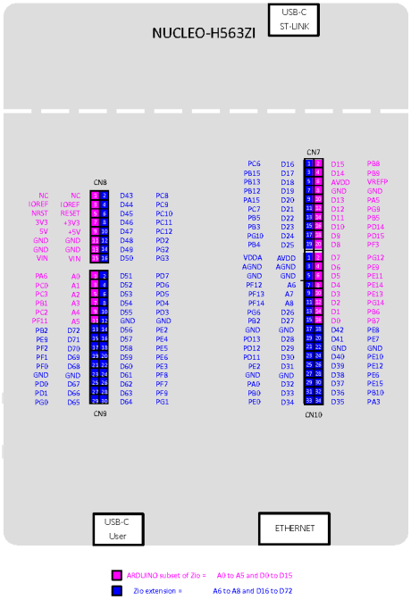

# Aufgabe 01 – Präemptives Scheduling mit zwei Tasks gleicher Priorität

> 📝 **Bearbeitung:** [→ Bearbeitung_01.md](Bearbeitung_01.md)
>
> ⚠️ **Diese Datei ist die Aufgabenstellung und darf nicht verändert werden.**
> Alle Antworten, Notizen und Code-Snippets gehören ausschließlich in die Bearbeitungsdatei.

---

## Aufgabenbeschreibung

Erarbeiten Sie sich die Grundlagen zum **Scheduling** von FreeRTOS.

**Quellen:**

| Quelle | Inhalt |
|---|---|
| [freertos.org – Scheduling](https://www.freertos.org/Documentation/02-Kernel/02-Kernel-features/01-Tasks-and-co-routines/04-Task-scheduling) | FreeRTOS Scheduling-Grundlagen |
| [freertos.org – Task States](https://www.freertos.org/Documentation/02-Kernel/02-Kernel-features/01-Tasks-and-co-routines/02-Task-states) | Task-Zustände |
| [freertos.org – xTaskCreate](https://www.freertos.org/Documentation/02-Kernel/04-API-references/01-Task-creation/01-xTaskCreate) | `xTaskCreate` |
| [freertos.org – vTaskDelay](https://www.freertos.org/Documentation/02-Kernel/04-API-references/02-Task-control/01-vTaskDelay) | `vTaskDelay` |
| [freertos.org – vTaskDelayUntil](https://www.freertos.org/Documentation/02-Kernel/04-API-references/02-Task-control/02-vTaskDelayUntil) | `vTaskDelayUntil` |
| [freertos.org – Task Priorities](https://www.freertos.org/Documentation/02-Kernel/02-Kernel-features/01-Tasks-and-co-routines/03-Task-priorities) | Task-Grundlagen und Prioritäten |
| [freertos.org – Kernel Overview](https://www.freertos.org/Documentation/02-Kernel/01-About-the-FreeRTOS-kernel/01-FreeRTOS-kernel) | FreeRTOS auf ARM Cortex-M |

Stellen Sie auf Basis dieser Grundlagen dar, wie sich FreeRTOS bei **präemptivem Scheduling von zwei Tasks gleicher Priorität** verhält.

Betrachten Sie die Aufgabenstellung zunächst **theoretisch** und anschließend **praktisch**, indem Sie ein Beispiel programmieren und die Dauer des Taskwechsels **messtechnisch** ermitteln.

> Für die messtechnische Untersuchung steht der **Trace-Debugger (iC5700 BlueBox + WinIDEA)** zur Verfügung.  
> Alternativ können GPIO-Toggle-Pins am Oszilloskop oder Logikanalysator ausgewertet werden.

> 📌 **GPIO-Pins für die Messung:** Verwenden Sie die dedizierten Debug-Pins des Boards (Connector **CN10**, rechts unten):
> | Pin | MCU-Pin | CN10-Pin |
> |-----|---------|----------|
> | DBG1 | PA3 | Pin 34 (D35) |
> | DBG2 | PE15 | Pin 30 (D37) |
> | DBG3 | PE12 | Pin 26 (D39) |
> | DBG4 | PE10 | Pin 24 (D40) |
>
> 
>
> Genaue Pin-Belegung: Board User Manual [**UM3115**](../Stm32/um3115-stm32h5-nucleo144-board-mb1404-stmicroelectronics.pdf), Seite 32.

---

