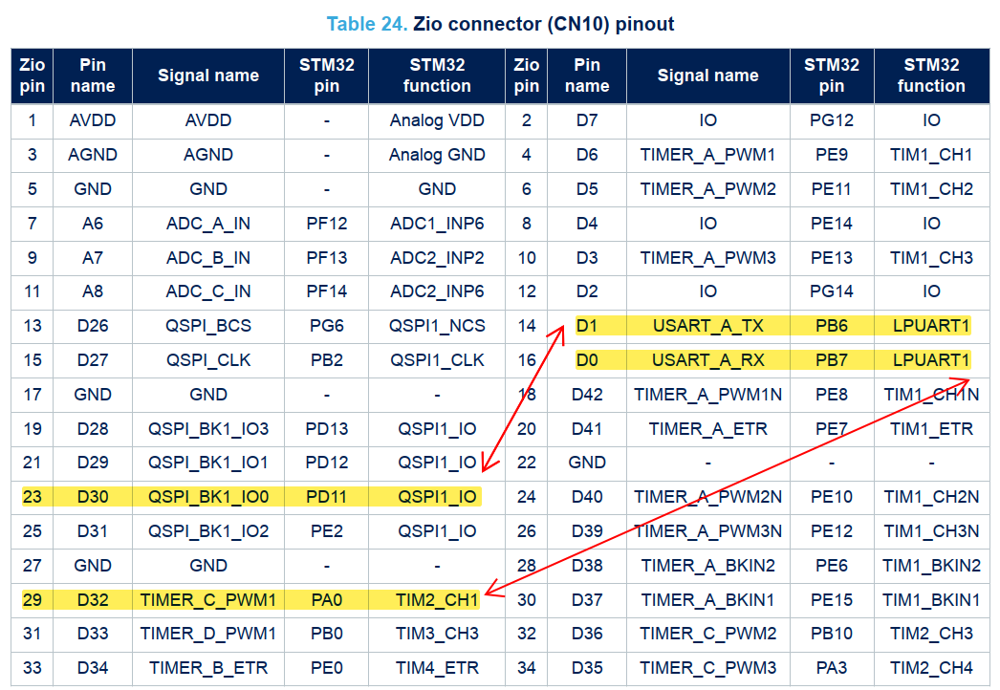
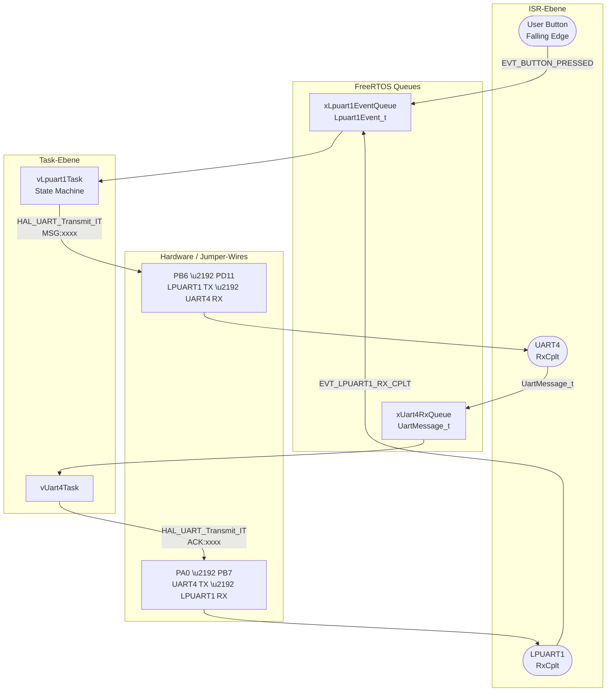
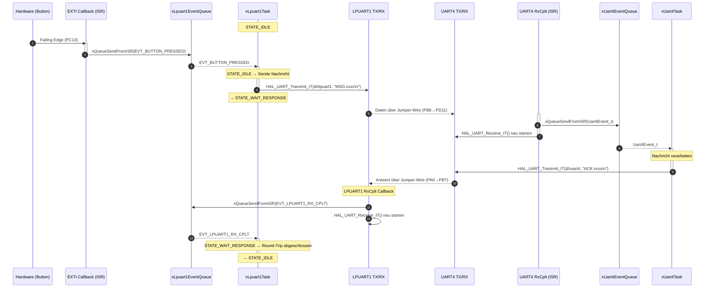
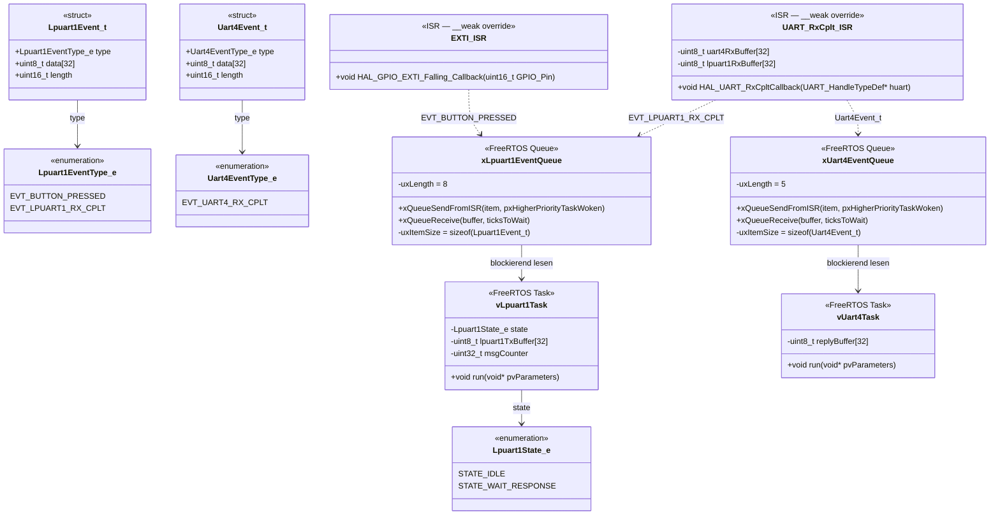
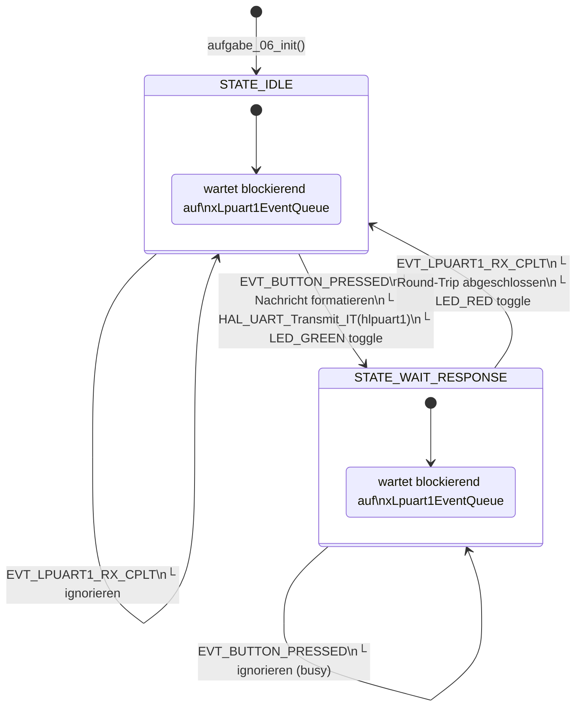

# Aufgabe 06 – UART-Kommunikation mit FreeRTOS Queue und Interrupt-Callbacks

> 📝 **Bearbeitung:** [→ Bearbeitung_06.md](Bearbeitung_06.md)
>
> ⚠️ **Diese Datei ist die Aufgabenstellung und darf nicht verändert werden.**
> Alle Antworten, Notizen und Code-Snippets gehören ausschließlich in die Bearbeitungsdatei.

---

## Lernziele

- **UART-Kommunikation** mit Interrupt-basiertem Senden und Empfangen
- **FreeRTOS Message Queues** für die ISR→Task-Kommunikation
- **Multi-UART-Kommunikation** zwischen zwei UART-Schnittstellen
- **`__weak`-Callback-Pattern** für UART RX/TX Complete Callbacks
- **Round-Trip-Zeitmessung** mit dem Trace-Debugger

---

## Aufgabenbeschreibung

In dieser Aufgabe wird ein **UART-Kommunikationssystem** implementiert, das zwei UART-Schnittstellen des STM32H563 nutzt, welche extern mit Jumper-Wires verbunden werden:

1. **Sende-Schnittstelle (LPUART1)**: Sendet bei Button-Druck eine Nachricht
2. **Empfangs-Schnittstelle (UART4)**: Empfängt die Nachricht und antwortet

Die Nachricht durchläuft folgende **Verarbeitungskette**:

```
Button-Druck
  ↓ EXTI-ISR → xLpuart1EventQueue
  ↓ vLpuart1Task (STATE_IDLE)
  ↓ HAL_UART_Transmit_IT (LPUART1 TX)
  ↓ [Jumper PB6 → PD11]
  ↓ UART4 RX → HAL_UART_RxCpltCallback → xUart4EventQueue
  ↓ vUart4Task
  ↓ HAL_UART_Transmit_IT (UART4 TX)
  ↓ [Jumper PA0 → PB7]
  ↓ LPUART1 RX → HAL_UART_RxCpltCallback → xLpuart1EventQueue
  ↓ vLpuart1Task (STATE_WAIT_RESPONSE) → Round-Trip abgeschlossen
```

Die **Round-Trip-Zeit** (Zeit vom Senden bis zum Empfang der Antwort) wird mit dem **Trace-Debugger** analysiert.

---

## Hardware-Setup

### Pin-Belegung

| Schnittstelle | Funktion | Pin   | Arduino-Header |
|---------------|----------|-------|----------------|
| LPUART1       | TX       | PB6   | D1             |
| LPUART1       | RX       | PB7   | D0             |
| UART4         | TX       | PA0   | –              |
| UART4         | RX       | PD11  | –              |

### Jumper-Wire-Verbindungen

Verbindet mit **zwei Jumper-Wires** die UART-Schnittstellen extern:

```
┌──────────────────────────────────────────────────────┐
│                   NUCLEO-H563ZI                      │
│                                                      │
│   LPUART1_TX (PB6/D1) ──────────┐                   │
│                                  │ Jumper 1          │
│   UART4_RX (PD11)     ◄─────────┘                   │
│                                                      │
│   UART4_TX (PA0)      ──────────┐                   │
│                                  │ Jumper 2          │
│   LPUART1_RX (PB7/D0) ◄─────────┘                   │
│                                                      │
└──────────────────────────────────────────────────────┘
```



### UART-Konfiguration (bereits in CubeMX vorkonfiguriert)

- **Baudrate**: 115200
- **Datenbits**: 8
- **Parität**: Keine
- **Stoppbits**: 1
- **Übertragungsmodus**: **Interrupt** (`HAL_UART_Transmit_IT` / `HAL_UART_Receive_IT`) – kein DMA, kein Polling

---

## Systemarchitektur

### Übersicht: Kommunikationsfluss



### Sequenzdiagramm



### Datentypen und Komponenten (Klassendiagramm)



### Zustandsdiagramm – `vLpuart1Task` State Machine



---

## Teil 1 – Theorie: UART-Callbacks und FreeRTOS Queues

### UART-Interrupt-Aufrufkette im STM32H5 HAL

Wie bereits in Aufgabe 05 für GPIO-Interrupts eingeführt, verwendet der STM32 HAL das **`__weak`-Callback-Konzept** auch für UART-Interrupts. Der vollständige Weg vom Hardware-Ereignis bis zum eigenen Code:

```
Daten empfangen / UART-Fehler (Hardware)
    │
    ▼
UART4_IRQHandler() / LPUART1_IRQHandler()      ← Interrupt-Vektor (stm32h5xx_it.c)
    │
    ▼
HAL_UART_IRQHandler(huart)                     ← HAL verarbeitet Interrupt-Flags
    │
    ├─ Empfang abgeschlossen  → HAL_UART_RxCpltCallback(huart)
    ├─ Senden abgeschlossen   → HAL_UART_TxCpltCallback(huart)
    └─ Fehler aufgetreten     → HAL_UART_ErrorCallback(huart)
                                  ↑
                     Hier greift eure __weak-Überschreibung
```

Die wichtigsten `__weak`-Callbacks im Überblick:

| Callback | Wird aufgerufen wenn... |
|----------|------------------------|
| `HAL_UART_RxCpltCallback(huart)` | Alle erwarteten Bytes empfangen (`HAL_UART_Receive_IT` abgeschlossen) |
| `HAL_UART_TxCpltCallback(huart)` | Alle Bytes gesendet (`HAL_UART_Transmit_IT` abgeschlossen) |
| `HAL_UART_ErrorCallback(huart)` | Framing-, Overrun- oder Parity-Fehler aufgetreten |
| `HAL_UART_TxHalfCpltCallback(huart)` | Halb gesendet (für Double-Buffering) |
| `HAL_UART_RxHalfCpltCallback(huart)` | Halb empfangen |

> ⚠️ **Einmalig**: `HAL_UART_Receive_IT()` empfängt genau **einmal** die angegebene Byte-Anzahl. Nach jedem `RxCpltCallback` muss der Empfang **explizit neu gestartet** werden – sonst werden keine weiteren Daten entgegengenommen.

> ⚠️ **Beide UARTs teilen denselben Callback**: `HAL_UART_RxCpltCallback` wird sowohl für LPUART1 als auch für UART4 aufgerufen. Die Unterscheidung erfolgt über `huart->Instance`:
>
> ```c
> void HAL_UART_RxCpltCallback(UART_HandleTypeDef *huart)
> {
>     if (huart->Instance == UART4) {
>         /* UART4 hat Daten empfangen */
>     } else if (huart->Instance == LPUART1) {
>         /* LPUART1 hat Daten empfangen */
>     }
> }
> ```

### ISR→Task-Kommunikation: Semaphore vs. Queue

In den vorherigen Aufgaben wurde eine **Binary Semaphore** zur Kommunikation zwischen ISR und Task verwendet – sie signalisiert lediglich, dass *irgendetwas* passiert ist, trägt aber **keine Daten**.

In dieser Aufgabe müssen die empfangenen UART-Bytes ebenfalls übermittelt werden. Dafür ist eine **Message Queue** das geeignete Mittel:

| Kriterium | Binary Semaphore | Message Queue |
|-----------|-----------------|---------------|
| Überträgt Daten | ❌ – nur Signal | ✅ – kopiert Nutzdaten |
| Puffert mehrere Ereignisse | ❌ – max. 1 pending | ✅ – konfigurierbare Tiefe |
| ISR-tauglich | ✅ (`GiveFromISR`) | ✅ (`SendFromISR`) |
| Blockiert bei leer | ✅ (Task wartet) | ✅ (Task wartet) |
| Typischer Einsatz | Tastendruck, Timer-Tick | UART RX, CAN-Frame, Messwert |

**Funktionsprinzip einer FreeRTOS Queue:**

```
┌─────────────────────────────────────────────────────────────┐
│                  FreeRTOS Message Queue                     │
│                                                             │
│  ISR (RxCplt)          Queue (FIFO)          Task           │
│                                                             │
│  Event_t evt  ──Send──►  [evt3][evt2][evt1]  ──Receive──►  │
│  (Kopie!)               ◄────── Tiefe 5 ──────►  (Kopie!)  │
│                                                             │
│  Daten werden by-value kopiert – kein gemeinsamer Speicher  │
└─────────────────────────────────────────────────────────────┘
```

Daten werden **by-value kopiert** in die Queue geschrieben und beim Lesen wieder kopiert. Es gibt keinen gemeinsamen Zeiger – das macht die Kommunikation thread-safe ohne expliziten Mutex.

### FreeRTOS Queue – API

```c
// Queue erstellen (einmalig in Init)
QueueHandle_t xQueue = xQueueCreate(QUEUE_LENGTH, sizeof(MyEvent_t));

// Aus ISR schreiben (MUSS ...FromISR verwenden!)
BaseType_t xHigherPriorityTaskWoken = pdFALSE;
xQueueSendFromISR(xQueue, &evt, &xHigherPriorityTaskWoken);
portYIELD_FROM_ISR(xHigherPriorityTaskWoken);  // Task ggf. sofort einplanen

// Im Task lesen (blockiert bis Daten verfügbar)
MyEvent_t receivedEvt;
if (xQueueReceive(xQueue, &receivedEvt, portMAX_DELAY) == pdTRUE) {
    // Event verarbeiten
}
```

`portYIELD_FROM_ISR(xHigherPriorityTaskWoken)` löst nach dem ISR-Rückkehr einen Kontextwechsel aus, **falls** der durch die Queue aufgeweckte Task eine höhere Priorität hat als der gerade unterbrochene Task. Ohne diesen Aufruf würde der Task erst beim nächsten regulären Scheduler-Tick eingeplant.

### Aufgabe (Theorie)

Beantwortet in der [Bearbeitung](Bearbeitung_06.md) folgende Fragen:

1. Warum muss in ISRs `xQueueSendFromISR()` statt `xQueueSend()` verwendet werden?
2. Was bewirkt `portYIELD_FROM_ISR(xHigherPriorityTaskWoken)` und wann ist es notwendig?
3. Erklärt den Unterschied zwischen `HAL_UART_Transmit_IT()` und `HAL_UART_Transmit()` (blocking). Warum darf `HAL_UART_Transmit()` im Task-Kontext nicht verwendet werden?
4. Was passiert, wenn `HAL_UART_Receive_IT()` nicht nach jedem `RxCpltCallback` erneut aufgerufen wird?
5. Warum ist für diese Aufgabe eine **Message Queue** geeigneter als eine **Binary Semaphore**?

---

## Teil 2 – Praktische Umsetzung

### Schritt 1: Datenstrukturen

Für die Kommunikation zwischen ISR und Task werden zwei eigene Typen benötigt:

- **`Lpuart1EventType_e`** – Enum der möglichen Events für `vLpuart1Task`:
  - `EVT_BUTTON_PRESSED` – Button wurde gedrückt
  - `EVT_LPUART1_RX_CPLT` – LPUART1 hat eine Antwort empfangen

- **`Lpuart1Event_t`** – Struktur die in `xLpuart1EventQueue` eingetragen wird; enthält den Event-Typ sowie optional die empfangenen Rohdaten und deren Länge.

- **`Uart4EventType_e`** – Enum der möglichen Events für `vUart4Task`:
  - `EVT_UART4_RX_CPLT` – UART4 hat Daten vollständig empfangen

- **`Uart4Event_t`** – Event-Struktur die in `xUart4EventQueue` eingetragen wird; enthält den Event-Typ sowie die empfangenen Rohdaten und deren Länge.

Zusätzlich werden statische Empfangs- und Sendepuffer für beide UART-Schnittstellen sowie ein Nachrichtenzähler benötigt.

### Schritt 2: Initialisierung (`aufgabe_06_init`)

Die Init-Funktion muss folgende Schritte in dieser Reihenfolge ausführen:

1. **Beide Queues erstellen** – `xLpuart1EventQueue` für Events an `vLpuart1Task`, `xUart4EventQueue` für Events an `vUart4Task`. Mit `configASSERT` auf Erfolg prüfen.
2. **Beide Tasks erstellen** – `vLpuart1Task` und `vUart4Task`, jeweils mit ausreichend Stack und gleicher Priorität.
3. **Interrupt-Empfang starten** – `HAL_UART_Receive_IT()` für UART4 (erwartet `MSG:xxxx\n` = 9 Bytes) und für LPUART1 (erwartet `ACK:xxxx\n` = 9 Bytes) aufrufen.

### Schritt 3: `EXTI_Falling_Callback` – Button-Event weiterleiten

Der Callback **sendet nicht selbst**, sondern leitet das Ereignis lediglich als `EVT_BUTTON_PRESSED` via `xQueueSendFromISR()` in `xLpuart1EventQueue` weiter. Das eigentliche Senden übernimmt der Task.

Am Ende `portYIELD_FROM_ISR()` aufrufen, damit der Task sofort eingeplant werden kann, falls er eine höhere Priorität hat.

### Schritt 4: `HAL_UART_RxCpltCallback` – Daten an Tasks übergeben

Der Callback wird für **beide** UART-Instanzen aufgerufen und muss sie anhand von `huart->Instance` unterscheiden:

- **UART4**: Eine `Uart4Event_t` mit Typ `EVT_UART4_RX_CPLT` und den empfangenen Rohdaten per `xQueueSendFromISR()` in `xUart4EventQueue` eintragen. Danach `HAL_UART_Receive_IT()` sofort neu starten.
- **LPUART1**: Ein `Lpuart1Event_t` mit Typ `EVT_LPUART1_RX_CPLT` und den empfangenen Rohdaten per `xQueueSendFromISR()` in `xLpuart1EventQueue` eintragen. Danach `HAL_UART_Receive_IT()` sofort neu starten.

### Schritt 5: `vLpuart1Task` – State Machine

Der Task blockiert mit `xQueueReceive(portMAX_DELAY)` auf `xLpuart1EventQueue` und verarbeitet eingehende Events abhängig vom aktuellen Zustand:

| Zustand | Event | Aktion | Folgezustand |
|---------|-------|--------|--------------|
| `STATE_IDLE` | `EVT_BUTTON_PRESSED` | Nachricht `"MSG:xxxx\n"` formatieren, per `HAL_UART_Transmit_IT(&hlpuart1, ...)` senden, **LED_GREEN** togglen | `STATE_WAIT_RESPONSE` |
| `STATE_IDLE` | `EVT_LPUART1_RX_CPLT` | ignorieren | `STATE_IDLE` |
| `STATE_WAIT_RESPONSE` | `EVT_LPUART1_RX_CPLT` | Round-Trip abgeschlossen, **LED_RED** togglen | `STATE_IDLE` |
| `STATE_WAIT_RESPONSE` | `EVT_BUTTON_PRESSED` | ignorieren (busy) | `STATE_WAIT_RESPONSE` |

### Schritt 6: `vUart4Task` – Empfangen und Antworten

Der Task blockiert mit `xQueueReceive(portMAX_DELAY)` auf `xUart4EventQueue`. Sobald ein `EVT_UART4_RX_CPLT`-Event vorliegt:

1. Antwort `"ACK:xxxx\n"` formatieren (gleicher Zählerstand wie empfangene Nachricht).
2. Per `HAL_UART_Transmit_IT(&huart4, ...)` senden.
3. **LED_YELLOW** togglen als Aktivitätsanzeige.

### Ziel der Aufgabe

1. Theoretisches Verständnis der **UART-Interrupt-Aufrufkette** im STM32 HAL und des `__weak`-Callback-Konzepts für UART-Events
2. Theoretischer Vergleich von **Binary Semaphore** und **Message Queue** als ISR→Task-Kommunikationsmittel – Erarbeitung des Unterschieds (Signal vs. Datentransport)
3. Praktische Implementierung einer **Multi-UART-Kommunikation** mit zwei FreeRTOS-Tasks, zwei Queues und einer State Machine
4. Praktische Anwendung des **Deferred Interrupt Processing**-Musters: ISR übergibt Daten über Queue, Task verarbeitet sie
5. Messtechnische Untersuchung der **Round-Trip-Zeit** mit dem Trace-Debugger (winIDEA / iC5700 BlueBox)

---

## Teil 3 – LED-Statusanzeige und Trace-Analyse

### LED-Zuordnung

Die drei LEDs des NUCLEO-H563ZI sollen den Systemzustand sichtbar machen:

| LED | Farbe | Bedeutung |
|-----|-------|-----------|
| `LED_GREEN` (PB0) | Grün | Toggle bei Button-Druck – Nachricht wurde gesendet |
| `LED_YELLOW` (PF4) | Gelb | Toggle wenn `vUart4Task` eine Nachricht empfängt und antwortet |
| `LED_RED` (PG4) | Rot | Toggle wenn der Round-Trip abgeschlossen ist (Antwort bei LPUART1 angekommen) |

Daran lässt sich der korrekte Ablauf visuell verifizieren: Bei jedem Button-Druck sollten alle drei LEDs in schneller Folge aufleuchten.

### Aufgabe (Trace-Analyse)

Analysiert den Nachrichtenfluss mit dem **Trace-Debugger** (winIDEA). Die Zeitmessung erfolgt rein über den Debugger – **keine** zusätzliche Pin-Instrumentierung notwendig.

1. Setzt **Breakpoints oder Watchpoints** auf die relevanten Stellen im Code (z. B. beim `xQueueSendFromISR`-Aufruf im UART4-Callback und beim LED-Toggle in `vLpuart1Task` nach `EVT_LPUART1_RX_CPLT`).
2. Messt die **Round-Trip-Zeit** – von der fallenden Flanke am User-Button bis zum Toggle von `LED_RED`.
3. Bestimmt die **einzelnen Zeitabschnitte**:
   - UART-Übertragungszeit LPUART1→UART4 (rechnet den theoretischen Wert für 9 Bytes bei 115200 Baud vorher aus und vergleicht)
   - Reaktionszeit `vUart4Task` (Queue-Latenz + Task-Scheduling)
   - UART-Übertragungszeit UART4→LPUART1
   - Reaktionszeit `vLpuart1Task` auf `EVT_LPUART1_RX_CPLT`
4. Dokumentiert die Ergebnisse mit Screenshots in der Bearbeitung und vergleicht gemessene mit theoretischen Werten.

---

## Hinweise

> 🔔 **UART im Interrupt-Modus**: Beide UART-Schnittstellen verwenden ausschließlich den **Interrupt-basierten Modus** (`_IT`-Suffix):
> - `HAL_UART_Transmit_IT()` – sendet non-blocking; **`HAL_UART_TxCpltCallback()`** wird nach Abschluss aufgerufen
> - `HAL_UART_Receive_IT()` – empfängt non-blocking; **`HAL_UART_RxCpltCallback()`** wird nach Abschluss aufgerufen
>
> Der blockierende Pendant `HAL_UART_Transmit()` / `HAL_UART_Receive()` **darf im Task-Kontext nicht verwendet werden** – er hält die CPU in einer Warteschleife und verhindert, dass der FreeRTOS-Scheduler andere Tasks ausführt.

> ⚠️ **ISR-Kontext beachten**: In Interrupt-Callbacks dürfen nur `...FromISR()`-Varianten der FreeRTOS-API verwendet werden!

> 💡 **Empfangslänge**: Bei `HAL_UART_Receive_IT()` muss die erwartete Byte-Anzahl angegeben werden. Bei variabler Länge kann alternativ `HAL_UARTEx_ReceiveToIdle_IT()` verwendet werden (empfängt bis Idle-Line erkannt wird).

> ⚠️ **Empfang nach Callback neu starten**: `HAL_UART_Receive_IT()` ist **einmalig** – nach jedem `HAL_UART_RxCpltCallback` muss der Empfang explizit neu gestartet werden, sonst werden keine weiteren Nachrichten empfangen.

> ⚠️ **Floating RX-Pin**: Sind die Jumper-Wires **nicht** gesteckt, liegt der RX-Pin von UART4 (PD11) und LPUART1 (PB7) im Floating-Zustand. Das erzeugt Framing-Fehler und `HAL_UART_ErrorCallback` wird sofort nach dem Start aufgerufen. Das ist kein Bug – der `ErrorCallback` startet den Empfang neu und der Fehler verschwindet sobald die Jumper gesteckt sind.

> 💡 **`HAL_UART_RxCpltCallback` wird nur bei exakt n Bytes ausgelöst**: Der Callback feuert **nur**, wenn die bei `HAL_UART_Receive_IT(&huart, buf, n)` angegebene Byte-Anzahl vollständig empfangen wurde. Kommen weniger Bytes an (z. B. weil die Gegenseite noch nichts sendet), bleibt der Callback aus. Deshalb ist die feste Nachrichtenlänge (`UART_MSG_FIXED_LEN = 9`, `UART_ACK_FIXED_LEN = 9`) auf beiden Seiten identisch zu wählen.

>  **Nachricht formatieren mit `snprintf`**: Die Funktion [`snprintf`](https://en.cppreference.com/w/c/io/fprintf) aus `<stdio.h>` schreibt eine formatierte Zeichenkette in einen Puffer und gibt die Anzahl geschriebener Zeichen zurück – dieser Rückgabewert kann direkt als Längenparameter für `HAL_UART_Transmit_IT()` verwendet werden. Beispiel: `int len = snprintf((char*)buf, sizeof(buf), "MSG:%04lu\n", counter);`

> 💡 **HAL UART Referenz**: Die vollständige Dokumentation der verwendeten HAL-Funktionen findet sich in der [STM32H5 HAL UART Dokumentation](https://www.st.com/resource/en/user_manual/um3122-description-of-stm32h5-hal-and-lowlayer-drivers-stmicroelectronics.pdf) (Kapitel UART). Die wichtigsten Funktionen im Überblick:
> - [`HAL_UART_Transmit_IT()`](https://www.st.com/resource/en/user_manual/um3122-description-of-stm32h5-hal-and-lowlayer-drivers-stmicroelectronics.pdf) – non-blocking senden
> - [`HAL_UART_Receive_IT()`](https://www.st.com/resource/en/user_manual/um3122-description-of-stm32h5-hal-and-lowlayer-drivers-stmicroelectronics.pdf) – non-blocking empfangen (exakt n Bytes)
> - `HAL_UART_RxCpltCallback()` – wird nach vollständigem Empfang aufgerufen (`__weak`, muss überschrieben werden)
> - `HAL_UART_ErrorCallback()` – wird bei Framing-/Overrun-Fehlern aufgerufen (`__weak`)

---

## Abnahmekriterien

- [ ] Button-Druck sendet Nachricht via LPUART1
- [ ] UART4 empfängt Nachricht und legt sie in Queue
- [ ] Handler-Task verarbeitet Nachricht und sendet Antwort
- [ ] LPUART1 empfängt Antwort (LED-Toggle als Bestätigung)
- [ ] Sequenzdiagramm entspricht der Implementierung
- [ ] Trace-Analyse dokumentiert die Round-Trip-Zeit

---

## Weiterführende Dokumentation

| Thema | Link |
|-------|------|
| Queue erstellen | [freertos.org – xQueueCreate](https://www.freertos.org/Documentation/02-Kernel/04-API-references/06-Queues/01-xQueueCreate) |
| `xQueueSend()` – Queue befüllen (Task-Kontext) | [freertos.org – xQueueSend](https://www.freertos.org/Documentation/02-Kernel/04-API-references/06-Queues/03-xQueueSend) |
| `xQueueSendFromISR()` – Queue befüllen (ISR-Kontext) | [freertos.org – xQueueSendFromISR](https://www.freertos.org/Documentation/02-Kernel/04-API-references/06-Queues/04-xQueueSendFromISR) |
| `xQueueReceive()` – Queue lesen (blockierend) | [freertos.org – xQueueReceive](https://www.freertos.org/Documentation/02-Kernel/04-API-references/06-Queues/09-xQueueReceive) |
| `portYIELD_FROM_ISR()` – Task-Wechsel aus ISR einleiten | [freertos.org – Deferred Interrupt Handling](https://www.freertos.org/Documentation/02-Kernel/02-Kernel-features/11-Deferred-interrupt-handling) |
| Queues – Konzeptübersicht | [freertos.org – Queue Management](https://www.freertos.org/Documentation/02-Kernel/02-Kernel-features/02-Queues-mutexes-and-semaphores/01-Queues) |
| Deferred Interrupt Handling | [freertos.org – Deferred Interrupt Handling](https://www.freertos.org/Documentation/02-Kernel/02-Kernel-features/11-Deferred-interrupt-handling) |
| `xTaskCreate()` – Task erstellen | [freertos.org – xTaskCreate](https://www.freertos.org/Documentation/02-Kernel/04-API-references/01-Task-creation/01-xTaskCreate) |